<p align="center">
  
</p>

<p align="center">
  <a href="#about">About</a>&nbsp;&nbsp;&nbsp;|&nbsp;&nbsp;&nbsp;
  <a href="#preview">Preview</a>&nbsp;&nbsp;&nbsp;|&nbsp;&nbsp;&nbsp;
  <a href="#technologies">Technologies</a>&nbsp;&nbsp;&nbsp;|&nbsp;&nbsp;&nbsp;
  <a href="#building">Building</a>&nbsp;&nbsp;&nbsp;|&nbsp;&nbsp;&nbsp;
  <a href="#contributing">Contributing</a>&nbsp;&nbsp;&nbsp;
</p>

## About
<strong>Workslog</strong> is a platform for ordering food in an easy and practical way.


## Preview

#### Occurrences Methods
```
http://localhost:8080/entregas/{personID}/ocorrencias
```
<p align="center">
    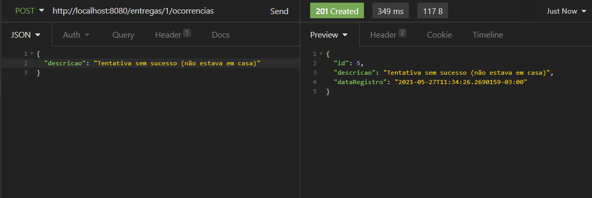
    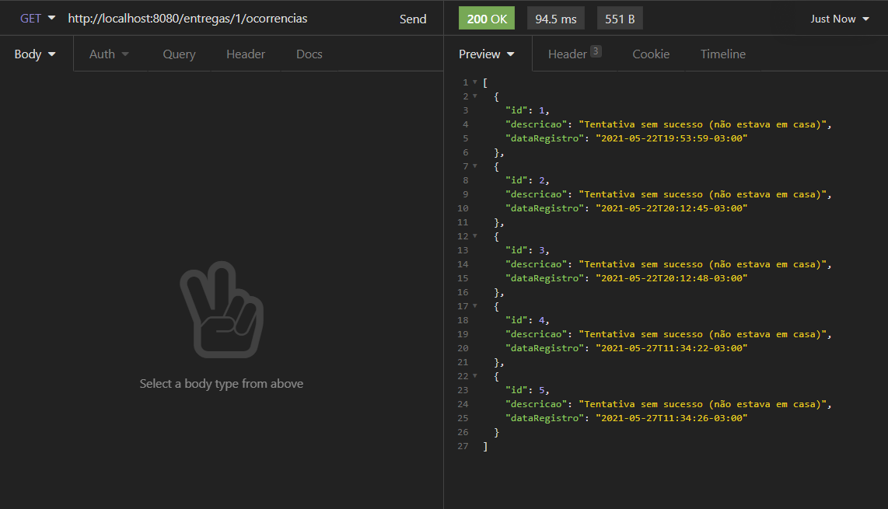
</p>

#### Delivery Methods
```
http://localhost:8080/entregas
```
<p align="center">
    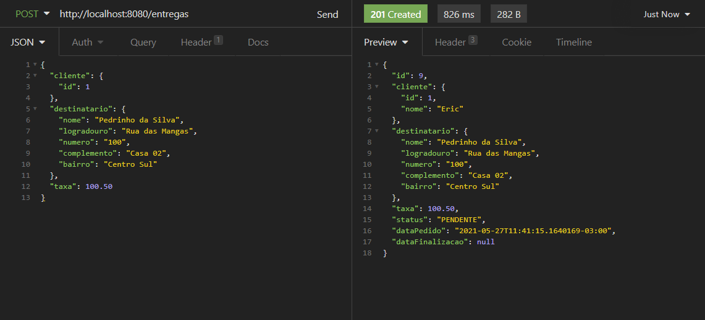
    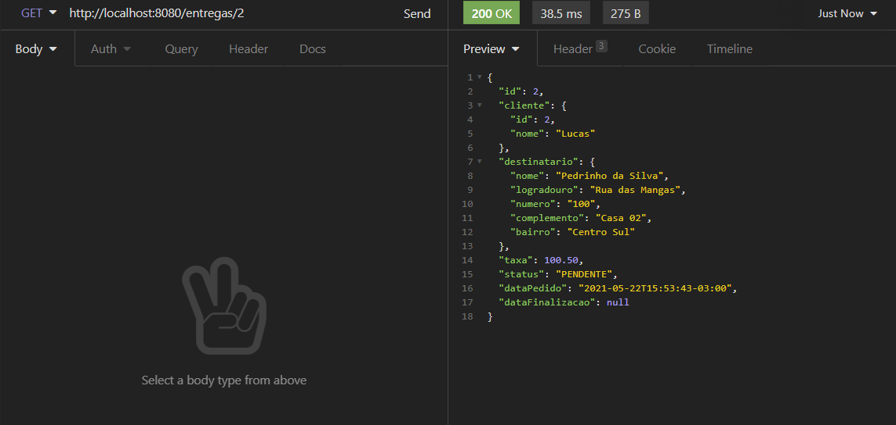
    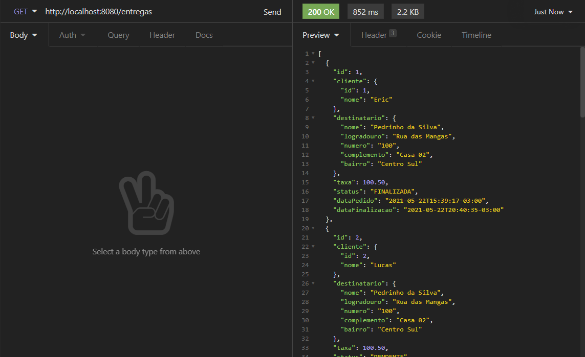
    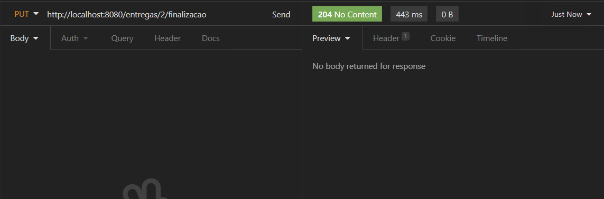
    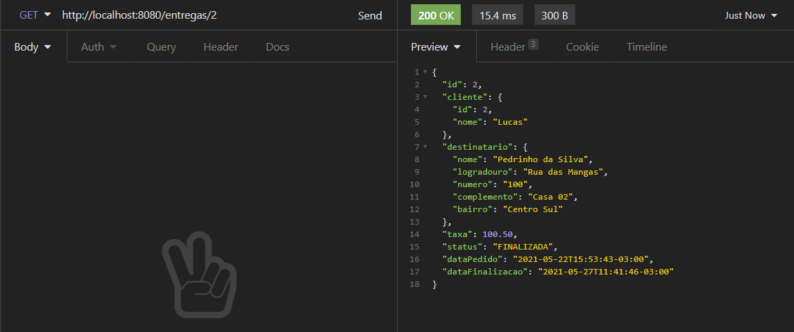
</p>

#### Client Methods
```
http://localhost:8080/clientes
```
<p align="center">
    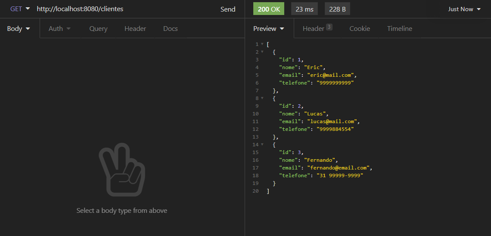
    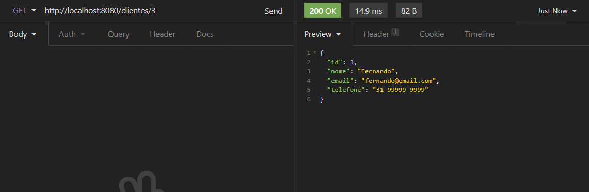
    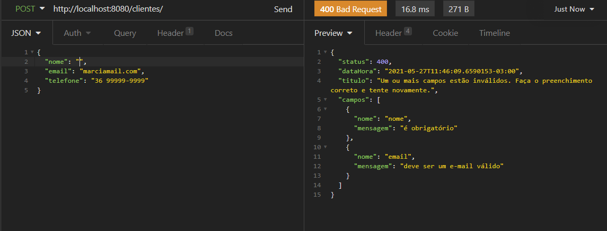
    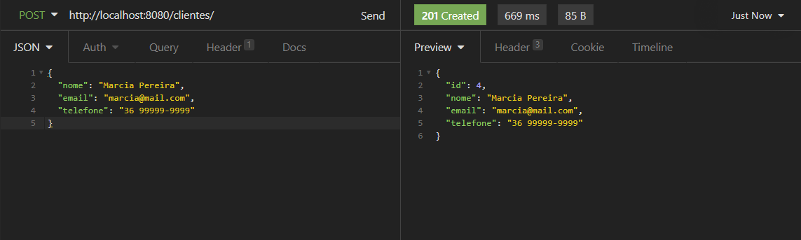
    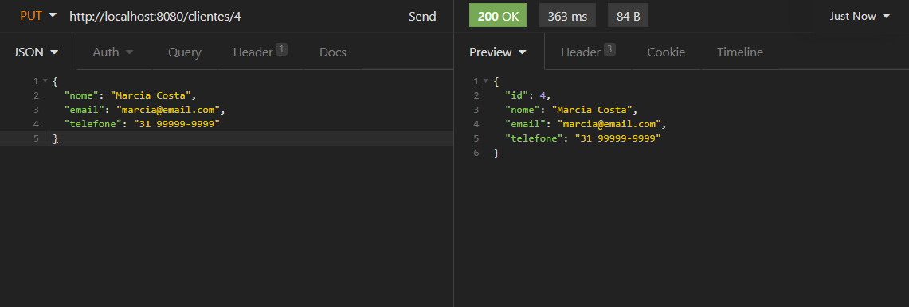
    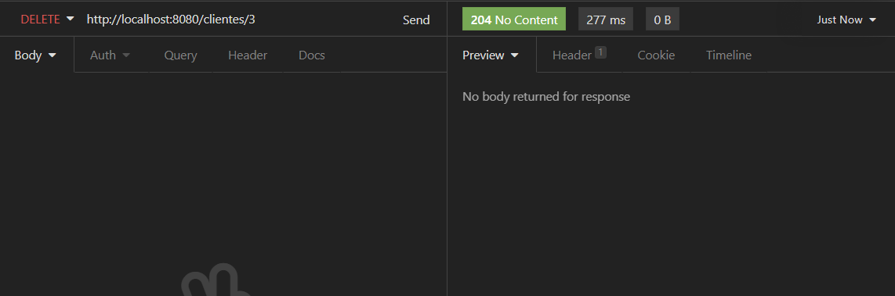
</p>


## Technologies
This project was developed using the following technologies:

- [Spring Boot](https://spring.io/)
- [Java](https://www.oracle.com/br/java/technologies/javase-jdk11-downloads.html)
- [FlyWay](https://flywaydb.org/)
- [ModelMapper](http://modelmapper.org/)

## Building

You'll need [Java 11+](https://www.oracle.com/br/java/technologies/javase-jdk11-downloads.html) and [Maven](https://maven.apache.org/download.cgi) installed on your computer in order to build this app.

```bash
git clone https://github.com/eric-souzams/workslog.git
$ cd /workslog
$ mvn spring-boot:run
```

## Contributing

This repository is currently under development. If you want to contribute please fork the repository and get your hands dirty, and make the changes as you'd like and submit the Pull request.